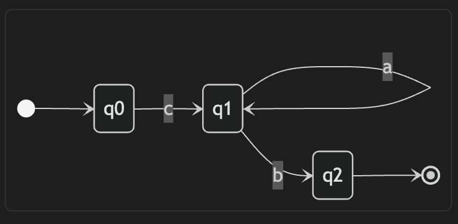

# chapter 6. 정규 표현식
## Intro
언어 패턴이나 이미지 인식과 같이 컴퓨터 소프트웨어가 패턴을 다루는 경우가 많음\
단어나 문자의 패턴을 인식하는 방법을 정규표현식으로 다룰 것임\
정규표현식은 직접 지정할 수 있는 패턴인데, 특수 문자를 사용하여 특정 문자, 숫자, 단어의 조합을 표현함\
파이썬 정규표현식 패키지는 유연한 고급 버전의 펄(Perl) 표준을 따름

## 6.1 정규표현식 소개
정규표현식은 주어진 단어와 일치하는 문자를 나열하는 것처럼 단순할 수 있음\
예를 들어 다음 패턴은 단어 'cat'과 일치함
```
cat
```
하지만 더 많은 단어로 구성된 집합과 일치하려면 어떻게 표현해야 하는가?\
예를 들어 다음과 같은 글자의 조합과 일치하는 단어를 표현하고 싶다면?
* 1개의 `'c'`문자와 일치
* `'a'`문자는 최소한 한 번 이상 등장
* 1개의 `'t'`문자와 일치

위의 조건에 맞는 정규표현식은 다음과 같다
```
ca+t
```
이 예시의 `'c'`,`'t'`와 같은 리터럴 문자는 반드시 정확하게 일치해야 하며, 그렇지 않은 경우 일치 결과를 얻지 못함\
문자 대부분은 리터럴 문자이며, 특수 문자로 리터럴 의미를 변경하지 않는 이상 각 문자는 리터럴이라고 가정\
모든 글자와 숫자는 그 자체가 리터럴 문자, 구두점 문자(punctuation characters)는 대개 근처 문자의 의미를 바꾸는 특수 문자

더하기 기호(+)는 특수 문자이며 정규표현식 처리기는 더하기 기호를 찾지 않음\
대신 `'a'와 함께 동작하는 부분표현식으로 최소 1개 이상의 'a'문자가 있는지`를 확인함

그러면 패턴 `ca+t`는 다음 문자들과 일치하게 됨
```
cat
caat
caaat
caaaat
```
실제 더하기 기호와 일치하는 문자를 찾으려면 어떻게 해야 하는가?\
이런 경우 역슬래시 기호(\\)를 사용하여 이스케이프 시퀀스(escape sequence)를 만들면 됨\
이스케이프 시퀀스는 특수 문자를 리터럴 문자로 돌려놓음
```
ca\+t
```
또 하나의 중요한 연산자는 곱하기 기호(*)\
곱하기 기호는 `바로 앞 문자가 없거나 여러 번 나타나는지` 확인함\
그래서 `'ca*t'`는 다음 문자들과 일치함
```
ct
cat
caat
caaat
```
특히 이 패턴은 ct와 일치함\
별표 기호는 표현식 지시자(expression modifier)이니 다르게 해석하면 안되며 다음 규칙을 따라야 함
* 별표 기호는 즉시 앞 문자의 의미를 변경하며, a*는 a문자가 업거나 여러 개로 구성되는 문자와 일치함

## 6.2 실제 예시 : 전화번호
전화번호를 검증하는 함수를 작성한다고 가정하면\
숫자를 의미하는 #을 사용하는 경우 다음과 같이 패턴을 작성할 수도 있음
```
###-###-####
```
정규표현식 문법으로는 다음과 같이 작성할 수 있음
```
\d\d\d-\d\d\d-\d\d\d\d
```
이 경우 역슬래시는 이스케이프 시퀀스로 동작하지만 d를 리터럴 문자로 만들지 않고, 특별한 의미를 부여함\
부분표현식 `\d`는 하나의 숫자와 일치한다는 것을 의미함\
다음 부분표현식으로도 숫자를 표현할 수 있음
```
[0-9]
```
2글자인 `\d`는 5글자인 `[0-9]`보다 간결함\
다음은 전화번호를 검증하는 정규표현식 패턴을 구현한 파이썬 프로그램
```python
import re
pattern = r'\d\d\d-\d\d\d-\d\d\d\d'

s = input('Enter tel. number :')
if re.match(pattern, s):
    print('Number accepted.')
else:
    print('Incorrect format.')
```
위 예시에서 가장 먼저 하는 일은 정규표현식 패키지를 탑재(import)하는 것\
이 작업은 정규표현식 기능을 사용하려는 각 모듈(소스 파일)마다 한 번씩만 수행하면 됨
```python
import re
```
두 번째 줄에서는 정규표현식 패턴을 `원시 문자열(raw string)`로 작성한 코드가 있음\
원시 문자열이라면 파이썬은 스스로 어떤 문자도 번역하지 않음\
가령 `\n`은 개행 문자로, `\b`는 벨을 울리는 것으로 번역하지 않음\
대신 `원시 문자열로 작성된 모든 텍스트는 정규표현식 검사기(evaluator)로 직접 전달됨`
```python
r'string' or r"string"
```
프롬프트로 사용자 입력을 받으면 프로그램은 re패키지를 탑재했으니 `re.match`로 match 함수를 호출함
```python
re.match(pattern, s)
```
패턴 인수가 대상 문자열(s)과 일치하면 함수는 일치하는 객체를 반환함\
그렇지 않으면 불리언 값 False로 변환될 None을 반환함\
불리언 값으로 반환된 값을 사용하면 되는데, 패턴과 일치하는 것이 확인되면 `True`를 반환하지만 그렇지 않으면 `False`를 반환함
* 정규표현식 지시 문자열 맨 앞에는 `r`을 항상 넣는 것이 좋음

## 6.3 일치 패턴 정제하기
앞 절에서 살펴본 전화번호 일치 예시가 잘 동작하지만 제약이 존재함\
`re.match`함수는 대상 문자열의 앞부분이 패턴과 일치하면 True 값을 반환하며 문자열 전체가 일치할 필요가 없음\
따라서 앞서 살펴본 정규표현식은 다음 패턴도 일치한다고 할 것임
```
555-345-5000000
```
만약 전체 문자열이 패턴과 정확하게 일치하여 남는 문자가 없도록 하려면 `'문자열의 종료'`를 의미하는 특수문자 `$`를 추가하면 됨\
이 문자는 정의한 패턴보다 더 많은 텍스트가 발견되면 일치하지 않는다고 판단함
```
pattern = r'\d\d\d-\d\d\d-\d\d\d\d$'
```
정규표현식 패턴을 정제하는 다른 방법도 살펴봄\
예를 들어 다음과 같이 두 가지 포맷을 허용하는 패턴을 정의한다고 가정함
```
555-123-5000
555 123 5000
```
이 두 패턴을 수용하려면 특정 위치에 허용할 수 있는 하나 이상의 값을 담은 문자 집합(set)을 만들 필요가 있음\
가령 다음 표현식은 `'a'`혹은 `'b'`는 허용하지만 둘다 등장하면 안됨
```
[ab]
```
문자 집합에 많은 문자를 넣을수도 있지만, 반드시 하나의 문자만 일치해야함\
예를 들어 다음 예시는 `'a'`, `'b'`, `'c'`, `'d'` 중 하나의 문자만 정확하게 일치해야 함
```
[abcd]
```
또한, 다음 표현식은 이번 예시에서 필요한 빈칸과 빼기 기호를 허용함
```
[ -]
```
이 표현식에서는 `대괄호 기호`만이 특수 문자임\
대괄호 기호 사이에 있는 문자는 리터럴이며, 그 중 하나의 문자만 일치해야 함\
`빼기 기호는 대괄호 기호 안에서 사용하면 특별한 의미를 지니는 경우가 많지만, 대괄호 기호 안에 맨앞이나 끝에 위치하면 리터럴로 인식`됨

다음 예시에서 전체 정규표현식을 확인해보자
```python
pattern = r'\d\d\d[ -]\d\d\d[ -]\d\d\d\d$'
```
그럼 이번 절에서 살펴본 조건들을 반영하여 정제한 패턴의 사용 예시 전체를 살펴보자
```python
import re
pattern = r'\d\d\d[ -]\d\d\d[ -]\d\d\d\d$'

s = input('Enter tel. number :')
if re.match(pattern, s):
    print('Number accepted.')
else:
    print('Incorrect format.')
```
이 패턴을 사용한 파이썬 정규표현식 검사기가 어떻게 동작하는지 되짚어보면
* 3개의 숫자가 일치하는지 확인함(`\d\d\d`)
* 문자 집합 `[ -]`을 읽은 후 빈칸 혹은 빼기 기호와 일치하는지 확인, 둘 중에 하나만 나타나야 함
* 3개의 숫자가 일치하는지 다시 확인함(`\d\d\d`)
* 다시 빈칸 혹은 빼기 기호가 나타나는지 확인함
* 4개의 숫자가 일치하는지 확인함(`\d\d\d\d`)
* 문자열이 반드시 끝나야 함(`$`). 4개의 문자가 일치한 후 어떤 문자도 나타나서는 안됨

남는 문자 없이 파턴과 정확하게 일치하게 강제하는 다른 방법은 `re.match` 메서드 대신 `re.fullmath` 메서드 사용\
다음 예시와 같이 `fullmath` 메서드를 사용하여 전화번호가 일치하는지 확인하면 문자열-종료 문자(`$`)를 사용할 필요가 없음
```python
import re
pattern = r'\d\d\d[ -]\d\d\d[ -]\d\d\d\d'

s = input('Enter tel. number :')
if re.fullmatch(pattern, s):
    print('Number accepted.')
else:
    print('Incorrect format.')
```
정규표현식을 내 것으로 만들기 전에 명심해야 할 것들
* 문자 개수는 정규표현식 패턴으로 표현할 때 특별한 의미를 가지고 있으며 모두 숙지하는 것이 좋음(특히 +나 *와 같은 표현식은 구두점 문자도 포함함)
* 특별한 의미를 지니고 있지 않은 모든 문자는 파이썬 정규표현식 번역기에서 리터럴 문자로 인식하며, 정규표현식 번역기는 이 문자들이 정확하게 일치하는지 확인함
* 역슬래시 기호는 보통 이스케이프 특수 문자에 사용되며, 특수 문자를 리터럴 문자로 만듦
* 역슬래시는 원래 문자에 특별한 의미를 부여하기 위해서도 사용되는데, `\d`는 `'d'`를 의미하는 것이 아니라 `'모든 숫자'`를 의미함

## 6.4 정규표현식 동작 방식: 컴파일 vs 실행
정규표현식의 처리 절차는 크게 두 가지 주요 단계로 나뉨
* 분석된 정규표현식 패턴은 일괄적으로 `상태 기계(state machine)`로 불리는 `열거형 데이터 구조(series)로 컴파일`됨
* 일치 유무를 판단하는 실제 행위는 정규표현식 검사기에 의해 `'컴파일 시간(compile time)`에 수행되는 것이 아니라, `'실행 시간(run time)'`에 수행됨\
실행 시간 중에는 프로그램이 상태 기계를 순회(traverse)하면서 일치를 찾음

간단한 예시를 들어보자\
제어자 +는 `"앞 표현식이 한 번 이상 나타나야 한다."`를 의미하며, 제어자 *는 `"앞 표현식이 나타나지 않거나, 여러번 나타날 수 있다."`라는 것을 의미함\
그렇다면 다음 패턴을 살펴보자
```
ca*b
```
이 표현식은 `'cb'`,`'cab'`,`'caab'`와 일치함\
정규표현식이 컴파일되면 아래와 같은 상태 기계를 생산함


다음 내용은 어떻게 프로그램이 상태 기계를 순회하면서 실행 시간에 일치를 찾는지 설명함
* 첫 문자를 읽음\
첫 문자가 `'c'`면 상태 기계는 `q1`상태로 이동함\
`'c'`가 아닌 다른 문자를 읽으면 실패함
* `'q1'`에서 `'a'`혹은 `'b'`가 올 수 있음\
`'a'`가 읽히면 상태 기계는 `'q1'`상태에 머무르며, 횟수와 상관없이 `'a'`를 계속해서 읽을 수 있음\
`'b'`가 읽히면 상태 기계는 `'q2'`로 이동하며, 이외의 문자가 읽히면 실패함
* 상태 기계가 `'q2'`에 다다르면 상태 기계는 종료되며, 성공했다고 보고함

이와 같이 상태 기계는 컴파일된 후 실행 시점에 순회 대상이 된다는 간단한 기본 원칙을 따름\
반드시 알아야 할 기능이 있는데, 만약 동일한 정규표현식 패턴을 여러 번 사용하는 경우가 있다면 해당 패턴을 먼저 컴파일하여 정규표현식 객체로 만든 후 그 객체를 반복하여 사용하는 것이 좋음\
파이썬의 정규표현식 패키지는 `compile` 메서드를 제공하여 이를 가능하게 함
```
regex_object_name = re.compile(pattern)
```
다음 코드는 compile 메서드를 사용하여 정규표현식 객체인 reg1을 만드는 예시
```python
import re

reg1 = re.compile(r'ca*b$')

def test_item(s):
    if re.match(reg1, s):
        print(s, 'is a match.')
    else:
        print(s, 'is not a match!')

test_item('caab')
test_item('caaxxb')

>>> caab is a match.
>>> caaxxb is not a match!
```
위 작업은 미리 정규표현식 객체로 컴파일하지 않고도 수행할 수 있음\
하지만 컴파일을 미리 수행하면 똑같은 패턴을 한 번 이상 사용할 때, 코드 실행 시간을 줄일 수 있음\
그렇지 않으면 파이썬은 한 번만 만들어도 되는 상태 기계를 여러 번 다시 만들게 됨

또 다른 기본 연산자는 `'둘 중에 하나만 선택(either-or)'`을 의미하는 `선택(alteration)연산자(|)`\
다음 패턴은 수직선 기호 양쪽의 표현식 중 하나와 일치하는지 확인함\
아래의 패턴은 무엇을 의미하는가?
```
ax|yz
```
`선택 연산자 |`는 모든 구문보다 우선순위가 낮음\
따라서 이 표현식은 `'ax'`혹은 `'yz'`와 일치하는지 확인하지만 `'axyz'`의 일치 유무를 확인하지는 않음\
소괄호 기호를 사용하지 않으면 이 표현식은 아래와 같이 해석됨
```
(ax)|(yz)
```
이제 소괄호 기호를 사용하여 검사 순서를 변경한 표현식을 살펴보자\
소괄호 기호를 사용하면 선택 연산자는 'x 혹은 y가 필요하지만 둘 다 나오면 안된다'로 번역됨
```
a(x|y)z
```
위에서 소괄호와 | 기호는 모두 특수 문자이며 이 동작 방식은 `선택 연산자(|)` 대신 문자 집합을 사용한 다음 표현식과 같음
```
a[xy]z
```
선택 연산자와 문자 집합 사이에 다른 점이 존재하는가? 그렇다\
문자 집합은 (더욱 복잡한 패턴의 부분일지라도) 항상 텍스트 중 하나의 문자와 일치해야 함\
반면 선택 연산자는 하나의 문자보다 더 긴 그룹이 포함될 수 있음\
예를 들어 다음 패턴은 `'cat'` 혹은 `'dog'`와 일치하지만 `'catdog'`와는 일치하지 않음
```
cat|dog
```

## 6.5 대소문자 무시하기, 그리고 다른 함수 플래그
정규표현식 패턴이 컴파일되거나 (`re.match`와 같은 함수를 호출하여) 바로 번역될 때, regex 플래그를 여러 개 조합하여 동작 방식에 영향을 줄 수 있음\
일반적으로 사용하는 플래그는 `re.IGNORECASE`\
예를 들어 다음 코드는 'Success'를 출력함
```python
if re.match('m*ack', 'Mack the Knife', re.IGNORECASE):
    print('Success')
```
패턴 `m*ack`는 단어 `Mack`과 일치함\
추가한 플래그가 파이썬에 글자의 대소문자를 무시하라고 지시하기 때문

다음 코드도 동일하게 동작함\
`I`는 `IGNORECASE` 플래그의 약어이기 때문에 `re.IGNORECASE`와 `re.I`는 같은 표현임
```python
if re.match('m*ack', 'Mack the Knife', re.I):
    print('Success')
```
2개의 플래그는 `2항 OR 연산자 (|)`를 사용하여 조합할 수도 있음\
다음과 같이 `I`와 `DEBUG` 플래그를 모두 함께 적용할 수도 있음
```python
if re.match('m*ack', 'Mack the Knife', re.I|re.DEBUG):
    print('Success')
```
| 플래그 | 약어         | 의미                                                |
|:--------|:---------|:---------------------------------------------------|
| ASCII | A | 아스키(ASCII)설정으로 가정함|
|IGNORECASE | I | 모든 '검색'과 '일치'는 대소문자를 구분하지 않음|
| DEBUG | | IDLE 안에서 연산이 실행되면 디버깅 정보가 출력됨|
| LOCALE | L | 문자숫자식, 단어 경계와 숫자에 로케일(LOCALE) 설정을 반영하여 일치를 찾음|
| MULTILINE | M | 문자열의 시작과 끝처럼 특수 문자 ^와 $는 줄의 시작과 끝을 의미함|
| DOTALL | S | 점기호(.)는 모든 문자와 일치하며, 개행 문자(\\n)도 포함됨|
| UNICODE | U | 문자숫자식, 단어 경계와 숫자가 유니코드(UNICODE)라는 가정하에 일치를 찾음|
| VERBOSE | X | 문자 클래스의 일부가 아닌 이상 패턴 안의 빈칸은 무시됨<br>코드에 표현식을 더 보기 좋게 작성하는 데 사용됨|

## 6.6 정규표현식 : 기본 문법 요약
||의미|
|:--------|:--------------------------------------------------|
| 메타 문자<br>(meta characters) | 특수 문자나 문자의 숫제라를 제어하는 문자(가령 '모든 숫자' 혹은 '모든 문자숫자식(alphanumeric)')를 위한 도구이며 각 문자는 한 번에 하나의 문자와 일치함|
| 문자 집합<br>(character sets) | 한 번에 하나의 문자와 일치하며 일치 대상 값의 집합이 주어짐 |
| 표현식 수량자<br>(expression quantifiers) | 이 연산자는 각 문자를 조합할 수 있게 해 줌<br>가령 와일드 카드(wildcard, *)는 표현식 패턴을 계속 반복할 수 있음 |
| 그룹<br>(groups) | 소괄호 기호를 사용하면 작은 표현식을 큰 표현식과 조합할 수 있음 |        

### 6.6.1 메타 문자
아래의 표는 문자의 모든 그룹이나 범위와 일치할 수 있는 와일드카드를 포함한 메타 문자를 나열하고 있음\
점 기호(.)는 몇 가지 제약 사항을 조건으로 임의의 문자 하나와 일치함

이런 메타 문자는 한 번에 하나의 문자와 정확하게 일치함\
메타 문자는 테이블에서 나열한 항목들 이외에 표준 이스케이프 시퀀스들도 포함됨\
표준 이스케이프 시퀀스에는 `\t(탭)`, `\n(개행)`, `\r(복귀)`,`\f(페이지 넘김)`, `\v(수직 탭)`등이 있음
| 특수 문자 | 이름/설명|
|:--------|:--------------------------------------------------|
| `.` | 점 기호 <br>개행 문자를 제외한 임의의 문자 하나와 일치함 <br>DOTALL 플래그가 주어지면 모든 문자와 일치할 수 있음 |
| `^` | 캐럿 기호 <br> 문자열의 시작을 의미함 <br>MULTILINE 플래그가 주어지면 줄의 시작을 의미할 수 있음(개행 문자 뒤의 모든 문자)|
| `$` | 문자열의 끝을 의미함 <br>MULTILINE 플래그가 주어지면 줄의 끝을 의미함(개행 문자 혹은 문자열 끝에서 바로 앞에 위치한 마지막 문자)|
|`\A` | 문자열의 시작을 의미함 |
|`\b` | 단어의 경계 <br> 예를 들어 `r'ish\b'`는 `'ish is'`와 `'ish)'`와 일치하지만 `'ishmael'`과는 일치하지 않음|
|`\B` | 비단어(nonword)의 경계 <br> 이 지점에서 새로운 단어가 시작되지 않는 경우에만 일치함 <br> 예를 들어 `r'al\B'`는 `'always'`와 일치하지만 `'al  '`과는 일치하지 않음|
|`\d` | 모든 숫자 <br> 0부터 9까지의 숫자를 포함함 <br> UNICODE 플래그가 설정되면 숫자로 분류된 유니코드 문자도 포함됨 |
| `\s` | 모든 여백(whitespace)문자 <br> 빈칸이나 `\t`, `\n`, `\r`, `\f`, `\f`, `\v`등이 포함됨 <br> UNICODE와 LOCALE 플래그가 설정되면 여백 문자 판단 기준이 변경될 수도 있음 |
|`\S` | 위에서 정의한 여백 문자가 아닌 모든 문자 |
| `\w` | 모든 문자숫자식 문자(글자 혹은 숫자) 혹은 언더스코어 기호(_)와 일치함 <br> UNICODE와 LOCALE 플래그가 설정되면 문자숫자식 판단 기준이 변경될 수도 있음 |
| `\W`| 위에서 정의한 문자숫자식 문자를 제외한 모든 문자 |
| `\z`| 문자열 끝을 의미 |

예를 들어 다음 정규표현식 패턴은 2개의 숫자로 시작하는 모든 문자열과 일치함
```python
r'\d\d'
```
하지만 다음 예시는 단 2개의 숫자로 구성된 문자열만이 일치함
```python
r'\d\d$'
```

### 6.6.2 문자 집합
파이썬 정규표현식의 문자-집합 문법은 다음에 일치해야 할 문자를 제어하는 더 나은 방법을 제공함
| | 설명|
|:--------|:--------------------------------------------------|
|`[문자_집합]` | 집합 안에 하나의 문자와 일치함|
|`[^문자_집합]` | 집합 안에 존재하지 않은 하나의 문자와 일치함 |

문자 집합은 직접 문자들을 나열하거나 조금 뒤에 다룰 범위를 지정하여 정의할 수 있음\
예를 들어 다음 표현식은 모든 모듬과 일치함
```
[aeiou]
```
가령 다음 정규표현식 패턴을 지정한다고 가정해 보자
```python
r'c[aeiou]t'
```
이 패턴은 다음 단어들과 일치함
```
cat
cet
cit
cot
cut
```
대괄호 밖에서 기존 의미를 유지하고 있는 `+`와 같은 다른 연산자와 범위를 조합활 수도 있음\
예시로 다음 표현식을 살펴보자
```
c[aeiou]+t
```
이 패턴은 다음과 같이 다양한 문자열과 일치할 수 있음
```
cat
ciot
ciiaaet
caaaauuut
ceeeeit
```
범위를 표현하는 `빼기 기호(-)`는 2개의 문자 사이 범위를 구체적으로 표현할 수 있으며 그렇지 않으면 리터럴 문자로 인식됨\
예를 들어 다음 범위는 소문자 'a'부터 소문자 'n'사이의 문자와 일치함
```
[a-n]
```
결국 이 범위는 'a', 'b', 'c'부터 'l', 'm', 'n'까지의 문자 중 하나와 일치함\
`IGNORECASE` 플래그가 주어지면 대상 문자의 대문자도 일치하게 됨

다음 패턴은 모든 대소문자 글자, 숫자와 일치함\
반면 `\w`와는 다르게 이 문자 집합에는 언더스코어(_)가 포함되지 않음
```
[A-Z-a-z0-9]
```
다음 패턴은 모든 16진수 숫자와 일치함\
16진수 숫자에는 숫자 0부터 9까지 혹은 대소문자 'A','B','C','D','E','F'가 포함됨
```
[A-Fa-f0-9]
```

문자 집합은 몇 가지 특별한 규칙이 존재함
* `대괄호 기호([])` 안의 문자 대부분은 여기에서 언급하는 특별한 경우를 제외하고는 특별한 의미를 잃음<br> 따라서 문자 대부분은 모두 리터럴로 인식됨
* `오른쪽 대괄호 기호(])`는 문자 집합을 종료하겠다는 특별한 의미를 갖음 <br> 만약 오른쪽 대괄호 기호를 문자 그대로 인식하려면 역슬래시를 사용해서 이스케이프 시퀀스로 만들어야 함
* `빼기 기호(-)`는 문자 집합의 시작 혹은 끝에 나타나서 리터럴 문자로 인식되지 않는 한 특별한 의미를 갖음 <br> 이와 유사하게 `캐럿 기호(^)`는 범위의 시작 부분에 나타나면 특별한 의미를 갖지만 그렇지 않은 경우 리터럴 문자로 인식됨
* `역슬래시 기호(\)`는 반드시 리터럴 문자가 아님 <br> 역슬래시를 표현하고 싶다면 `\\`를 사용하면 됨

예를 들어 문자 집합 사양 밖에서 산술연산자 `+`와 `*`는 특별한 의미를 가지고 있음\
하지만 대괄호 기호 안에 들어오면 본연의 의미를 잃게 되며, 이 문자들과 일치하는 범위를 지정할 수 있음
```
[+*/-]
```
범위 사양은 `빼기 기호(-)`를 포함하지만 문자 집합의 중간이 아닌 끝에 나타나기 때문에 특별한 의미를 가지고 있지 않음

다음 문자 집합 사양은 4개의 연산자인 `+`, `*`,`/`,`-`를 제외한 모든 문자를 찾기 위해 캐럿 기호를 사용함\
캐럿 기호는 맨 앞에 등장했기 때문에 특별한 의미를 갖음
```
[^+*/-]
```
하지만 `캐럿 기호(^)`가 다른 위치에 있는 다음 예시는 5개의 연산자 `+`, `*`,`/`,`-`, `^`와 일치하는지를 확인함
```
[+*^/-]
```

따라서 다음 파이썬 코드가 실행되면 Success!를 출력할 것임
```python
import re
if re.match(r'[+*^/-]','^'):
    print('Success!')
```
반면 다음 파이썬 코드는 Success!를 출력하지 않음\
문자 집합 시작 지점에 나타난 캐럿 기호가 문자 집합 의미를 반대로 뒤집었기 때문
```python
import re
if re.match(r'[^+*^,-]','^'):
    print('Success!')
```
### 6.6.3 패턴 수량자

| 구문 | 설명|
|:--------|:--------------------------------------------------|
| `expr*` | expr 표현식이 한 번만 나타나는 대신 나타나지 않을 수도 있고 여러 번 나타날 수 있음 <br> 가령 a*는 'a', 'aa', 'aaa'와 일치하며, 빈 문자열과도 일치함 |
| `expr+` | expr 표현식이 한 번 이상 나타날 수 있음 <br> 가령 a+는 'a', 'aa', 'aaa'와 일치함 |
| `expr1 \| expr2` | 둘 중 하나만 선택(alternation) <br> expr1이 한 번만 나타나거나 expr2가 한 번만 나타나야 하며 둘 다 나타나면 안 됨 <br> 가령 a \| b는 'a' 혹은 'b'와 일치함 <br> 이 연산자의 우선순위가 매우 낮기 때문에 예를 들어 cat\|dog는 cat 혹은 dog와 일치함|
|`expr{n}`| expr 표현식이 정확히 n번 나타남 <br> 가령 a{3}은 'aaa'와 일치, sa{3}d는 'saaad'와 일치하지만 'saaaaaad'와는 일치하지 않음 |
| `expr{m,n}`| expr 표현식이 최소 m번, 최대 n번 나타날 수 있음 <br> 가령 x{2,4}y는 'xxy', 'xxxy', 'xxxxy'와는 일치하지만 'xxxxxxy'나 'xy'와는 일치하지 않음|
|`expr{m,}` | expr 표현식이 최소 M번 이상 나타나야 하지만 최대 출현 횟수의 제한은 없음 <br> 가령 x{3,}은 패턴 'xxx'가 나타나는지 확인하며, 세 번 이상 나타나도 됨|
|`expr{,n}` | expr 표현식이 나타나지 않아도 되지만, 최대 n번까지 나타날 수 있음 <br> 가령 ca{,2}t는 'ct', 'cat', 'caat'와 일치하지만 'caaat'와는 일치하지 않음|
|`(expr)` | 정규표현식 검사기가 expr을 하나의 그룹으로 인식함 <br> 이 기능이 필요한 이유는 두 가지 <br> 첫 번째, 수량자는 바로 앞에 있는 표현식에만 적용되지만, 표현식이 그룹인 경우 그룹 자체에 적용됨 <br> 가령 (ab)+는 'ab', 'abab', 'ababab'와 일치함 <br> 두 번째, 나중에 그룹 단위로 일치 유무를 판단하거나 텍스트를 교체하기 위해 다시 참조될 수 있기에 그룹을 명시하는 것이 중요함 |
|`\n`| 일치된 그룹을 참조함 <br> 참조는 실제로 실행 시간에 찾음 <br> 단순히 해당 패턴 자체를 반복하지는 않음 <br> \\1은 첫 번째 그룹을 참조하며, \\2는 두 번째 그룹을 참조함 |

위 표의 모든 수량자(quantifier)는 표현식 지시자(modifier)이지만, 표현식 확장자(extender)는 아님\
위 표에서 나열한 next-to-last 수량자는 그룹을 만들기 위해 소괄호 기호를 사용함\
그룹화(grouping)는 패턴의 의미에 많은 영향을 미침\
항목을 소괄호 기호 안에 넣어도 나중에 참조할 수 있게 태그가 달린 그룹(tagged group)을 만들 수 있음

표에서 보여준 숫자 수량자를 사용하면 일부 표현식을 더 쉽게 표현하거나 적어도 더 간결하게 만들 수 있음\
예를 들어 앞서 살펴본 전화번호 검증 패턴을 생각해 보자
```python
r'\d\d\d-\d\d\d-\d\d\d\d'
```
이 패턴을 다음과 같이 수정할 수 있음
```python
r'\d{3}-\d{3}-\d{4}'
```
이 예시는 키보드 입력 횟수를 약간 줄여 주는 정도이지만, 다른 경우에는 더 많이 줄여 줄 수도 있음\
이 기능을 활용하면 더 읽기 좋고 관리하기 쉬운 코드를 작성할 수 있음

소괄호 기호는 단순한 명확성을 넘어서 많은 의미를 갖음\
그룹을 지정하는 가장 중요한 이유는 `패턴이 구문 분석되는(parsed)방식에 영향을 줄 수 있기 때문`\
예를 들어 다음 두 패턴을 살펴 보자
```python
pat1 = r'cab+'
pat2 = r'c(ab)+'
```
첫 번째 패턴은 'b'가 반복되는 문자열과 일치하지만 두 번째 패턴은 그룹화 기능을 사용하여 'ab'가 반복되는 문자열과 일치함

### 6.6.4 역추적, 탐욕적 수량자와 게으른 수량자
파이썬 정규표현식은 무척 유연한데, 특히 정규표현식 검사기는 `역추적(backtracking)`이라고 불리는 기술을 사용하더라도 최대한 더 많은 일치를 찾으려고 함\
다음 예시를 살펴보면
```python
import re
pat = r'c.*t'
if re.match(pat, 'cat'):
    print('Success!')
```
패턴 `c.*t`는 대상 문자열 'cat'과 일치하는가?\
패턴의 `'c'`는 문자열에서 하나의 'c'와 일치하고, `'t'`는 하나의 't'와 일치하며, `.*`는 '모든 개수의 문자와 일치'한다고 하니 'cat'은 반드시 일치해야 함\
하지만 `.*`패턴을 문자 그대로 해석하면 다음과 같이 동작해야 하지 않는지 생각해보자
* `'c'`와 일치
* 일반적인 패턴 `.*`로 인해 나머지 문자 모두('at')가 일치
* 문자열 끝에 도달하였고, 정규표현식 검사기는 't'를 찾으려고 했지만 찾지 못함 <br> 이미 문자열의 끝에 도달하였기 때문에 결과는 실패로 보임

정규표현식 검사기는 문자열에서 패턴과 일치하는 것을 찾지 못하면 역추적을 시작하며 `.*`기반으로 문자들이 일치하는지 확인함\
한 문자를 역추적해 보면 대상 문자열 'cat'이 일치한다는 것을 찾을 수 있음


그 과정을 요약하면 다음과 같음

패턴: `c  .*  t`\
&emsp;&emsp;&emsp;↓
| 단계 | |
|:--------|:--------------------------------------------------|
| 1. | `c` → 'c' 일치 |
| 2. | `.*` → 탐욕적으로 남은 'at' 전부 소비 → 문자열 끝까지 이동|
| 3. | `t`  → 확인할 문자 없음 → 실패!|
| 4. | `백트래킹`: `.*` 가 'a'만 소비하도록 한 칸 반납|
| 5. | `t`  → 't' 일치 → 성공!|

즉 `.*`가 처음부터 딱 하나만 먹는 게 아니라 끝까지 다 먹은 뒤, t를 맞추지 못하면 한 칸씩 뱉어내면서 재시도하는 것이 백트래킹

문자열이 'caaaaaat'이라면 `.*`는 'aaaaaat'을 전부 삼킨 뒤 t를 못 찾고, t 하나를 반납 → 'aaaaaа' 소비 + t 일치 순서로 동작

게으른(lazy) 수량자 `.*?` 를 쓰면 반대로 최소한만 먹고 늘려가므로 백트래킹 방향이 반대가 됨

파이썬 정규표현식 문법이 역추적을 시도하더라도, 일치할 수 있는 모든 패턴을 유연하고 정확하게 찾아냄\
모든 패턴 사양은 역추적을 하는 한이 있더라도, 패턴과 일치하는 모든 경우를 보고하는 황금 규칙을 따름\
하지만 이 규칙을 따르다 보면 종종 예상하지 못하는 결과가 나올 수 있는데, '탐욕적 일치 vs 게으른 일치'\
일치 결과가 하나 이상 발견되었을 때 어떤 문자열을 선택하느냐에 관한 이슈

## 6.7 정규표현식 실습 예시
비밀번호 테스트 조건
* 모든 문자는 대문자 혹은 소문자, 숫자 혹은 언더스코어, 혹은 구두점 문자
* 최소 길이는 8문자이며, 최소한 글자 1개, 숫자 1개, 구두점 문자 1개가 포함되어야 함

위 조건의 테스트 코드를 작성한다면?\
다음 검증 함수는 필요한 테스트를 수행함

```python
import re

pat1 = r'(\w|[@#$%^&*!]){8,}$'
pat2 = r'.*\d'
pat3 = r'.*[a-zA-Z]'
pat4 = r'.*[@#$%^&*!]'

def verify_passwd(s):
    b = (
        re.match(pat1, s) and
        re.match(pat2, s) and
        re.match(pat3, s) and
        re.match(pat4, s)
    )
    return bool(b)
```
`verify_passwd`함수는 대상 문자열에 4개의 서로 다른 일치 조건을 테스트함\
`re.match`함수는 pat1부터 pat4까지 서로 다른 패턴 4개와 함께 각각 호출됨\
이 패턴 4개와 전달받은 문자열이 일치하면 결과는 `True`

첫 번째 패턴은 글자, 문자와 언더스코어, @#$%^&*! 중 하나를 허용하며, 8개의 문자를 요구함\
`\w`는 메타 문자로 '모든 문자와 숫자'와 일치함\
소괄호 기호안에 함께 들어간 표현식은 '모든 문자나 숫자 혹은 나열된 구두점 문자 중 하나와 일치'한다는 것을 의미함
```
(\w|[@#$%^&*!]){8,}
```
자세히 보면 수직선 기호(`|`)로 양쪽 중 하나를 선택(alteration)하고 있음\
이 부분 패턴은 '`\w`와 일치하거나 문자 집합 `[@#$%^&*!]`안에 있는 문자 하나와 일치한다.'라는 것을 의미함

대괄호 기호 안의 문자들은 대괄호 기호 밖에 있을 때 지녔던 특별한 의미를 잃음\
따라서 범위 지시자 안에 모든 문자는 특수 문자가 아닌 리터럴 문자로 인식됨

이 모든 것을 합치면 부분표현식은 '문자나 숫자(`\w`)와 일치하거나 나열된 구두점 문자 중에 하나와 일치한다'로 해석됨\
다음에 나타나는 패턴 `{8,}`은 최소한 8번 나타나야 한다는 것을 말하고 있음

끝으로 문자열-종료 지시자인 `$`가 등장함\
줄-종료 기호 `$`를 붙이면 마지막 문자를 읽고 나서 문자열이 끝나야 하기에 빈칸 같은 문자가 추가될 수 없음
```
(\w|[@#$%^&*!]){8,}$
```

나머지 테스트는 특정 문자가 존재하는지 확인하는 각각 다른 문자열을 `re.match`와 함께 사용하여 구현함\
예를 들어 `pat2`는 모든 종류의 문자와 개수 제한 없이 일치(`.*`)한 후 숫자가 나와야함\
정규표현식 패턴은 '0개부터 여러 개의 문자와 일치한 후 하나의 숫자와 일치한다.'로 해석됨
```
.*\d
```
다음 패턴 `pat3`은 0개부터 여러 개의 문자와 일치(`.*`)한 후 대문자 혹은 소문자 글자와 일치함
```
.*[a-zA-Z]
```
마지막 패턴은 0개 혹은 여러 개 문자와 일치한 후 범위 `@#$%^&*!`안의 한 문자와 일치함
```
.*[@#$%^&*!]
```

## 6.8 Match 객체 사용하기
`re.match`함수는 대상 문자열이 패턴과 일치하면 `match`객체를 반환하며, 일치하지 않으면 특수 객체인 `None`을 반환함\
지금까지 우리는 이 값(객체 혹은 None)을 불리언 값(True/False)으로 다루었으며, 이는 파이썬에서는 유효한 방법임
* 파이썬은 불리언 타입이 아닌 데이터 타입도 불리언으로 테스트 가능(None은 False를 반환, 객체가 있는 경우 True 반환)

`match`객체는 일치 정보를 확인하는 데 사용할 수 있음\
예를 들어 정규표현식 패턴은 소괄호 기호를 사용하는 경우 부분 그룹으로 나누어짐\
`match`객체는 각 부분 그룹에 일치하는 텍스트가 무엇인지 확인하는 데 사용할 수 있음

예를 들어 다음 코드를 실행해 보자
```python
import re

pat = r'(a+)(b+)(c+)'
m = re.match(pat, 'abbccce')
print(m.group(0))
print(m.group(1))
print(m.group(2))
print(m.group(3))

>>> abbccc
>>> a
>>> bb
>>> ccc
```
이 예시에서 볼 수 있는 `group` 메서드는 다음과 같이 패턴과 일치하는 전체 혹은 부분 텍스트를 반환함
* `group(0)`은 정규표현식 패턴에 일치한 전체 텍스트를 반환함
* `group(n)`에서 n은 1부터 시작하며, 소괄호 기호로 나누어진 그룹에 일치하는 그룹을 순서대로 반환함\
첫 번째 그룹은 `group(1)`로 접근할 수 있고, 두 번째 그룹은 `group(2)`로 접근이 가능하며, n번째 그룹은 `group(n)`으로 접근할 수 있음

`match`객체의 또 다른 속성은 `lastindex`\
이 속성은 일치 유무를 판단하여 반환한 그룹 중 마지막 그룹의 숫자를 정수로 보관함\
앞에서 살펴본 예시는 다음과 같이 평범한 루프로 작성 가능함
```python
import re

pat = r'(a+)(b+)(c+)'
m = re.match(pat, 'abbcccee')
for i in range(m.lastindex + 1):
    print(i, ', ', m.group(i), sep='')

>>>
0. abbccc
1. a
2. bb
3. ccc
```
`range`함수는 0부터 시작하여 인수로 주어진 숫자보다 작은 정수까지만 생성하기에 `m.lastindex`에 1을 더함


`match`객체 속성
| 구문 | 설명|
|:--------|:--------------------------------------------------|
|`group(n)`| 특정 그룹에 속한 텍스트를 반환 <br> 그룹은 1부터 시작하며, 기본값 0은 일치한 전체 문자열의 텍스트를 반환함|
|`groups()`|일치한 모든 텍스트를 담고 있는 그룹들을 나열한 튜플이 반환됨 <br> 첫 번째 하위 그룹인 그룹 1부터 시작함|
|`groupdict()`|이름이 있는 모든 그룹으로 구성된 딕셔너리를 반환함<br> 포맷은 `이름:텍스트`|
|`start(n)`|대상 문자열 안에서 n으로 참조할 수 있는 그룹의 시작 지점을 반환함 <br> 문자열 안의 위치는 0부터 시작하지만 그룹 숫자는 1부터 시작함 <br> 따라서 `start(1)`은 첫 번째 그룹의 문자열 색인 시작 지점을 반환함 <br> `start(0)`은 모든 일치 텍스트의 문자열 색인 시작 지점을 반환함|
|`end(n)`|`start(n)`과 비슷하지만 `end(n)`은 전체 대상 문자열에 식별된 그룹의 종료 지점을 가져옴 <br> 이 문자열 안에는 대상 문자열의 '시작'색인부터 시작하여 '종료'색인 바로 전까지의 모든 문자를 지니고 있음 <br> 예를 들어 시작과 종료 값이 0과 3이면 첫 3개의 문자가 패턴과 일치한다는 의미임|
|`span(n)`|`start(n)`과 `end(n)`이 제공하는 정보를 튜플로 반환함|
|`lastindex`|그룹 중 가장 높은 색인 숫자|

## 6.9 패턴에 맞는 문자열 검색
지금까지 패턴에 정확하게 일치하는 텍스트를 찾는 것에 정규표현식을 사용함\
하지만 정규표현식을 사용하는 다른 기본적인 용도는 검색임\
전체 문자열이 아니라, 패턴에 맞는 부분이 있는지를 확인함\
이번 절에서는 패턴에 맞는 첫 번째 부분 문자열을 찾는 것에 초점을 맞추며, `re.search`함수가 이 작업을 수행함
```
일치_객체 = re.search(패턴, 대상_문자열, flags=0)
```
이 문법에서 '패턴'은 정규표현식 패턴인 문자열이거나 사전에 컴파일된 정규표현식 객체가 될 수 있음\
'대상_문자열'은 검색 대상 문자열, flags 인수는 선택 사항이며, 기본값은 0

이 함수로 일치하는 부분을 찾으면 `match`객체를 반환하며, 그렇지 않은 경우 `None`을 반환함\
이 함수는 `re.match`와 동작 방식이 비슷하지만 문자열의 시작 부분이 패턴과 일치할 필요는 없음\
예를 들어 다음 코드는 두 자릿수 이상의 숫자가 처음으로 나타나는 지점을 찾음
```python
import re

m = re.search(r'\d{2,}', '1 set of 23 owls, 999 doves.')
print('"', m.group(),'" found at ', m.span(), sep='')
```
이 코드에서는 검색 대상 문자열이 2개 이상의 숫자여야 일치하는 간단한 패턴을 보여줌\
검색 패턴은 다음과 같이 앞서 소개한 특수 문자를 사용한 정규표현식 문법으로 쉽게 표현할 수 있음
```
\d{2,}
```
코드의 나머지 부분은 `match`객체를 m 변수에 대입하여 사용함\
이 객체의 `group`과 `span`메서드를 사용하여 무엇이 일치했고 대상 문자열의 어느 부분에서 일치했는지에 관한 정보를 가져옴\
이 코드의 출력 결과는 다음과 같음
```
"23" found at (9, 11)
```
검색하니 부분 문자열 23이 발견되었다고 알려줌\
`m.group()`은 일치한 문자인 23을 반환하는 동안, `m.span()`은 대상 문자열에서 해당 부분 문자열을 발견한 시작 지점과 종료 지점을 튜플 (9,11)로 반환함\
다른 색인들과 마찬가지로 시작 지점은 0부터 시작하기에 값 9가 의미하는 것은 대상 문자열의 10번째 문자가 시작 지점인 것을 의미\
부분 문자열은 종료 지점인 색인 11 바로 앞까지의 모든 문자를 포함함

## 6.10 반복하여 검색하기(findall)
특정 패턴과 일치하는 모든 부분 문자열을 찾는 것은 가장 일반적인 검색 작업이며, 이 작업은 모든 검색 결과를 파이썬 리스트로 반환하는 함수를 제공하기 때문에 어렵지 않음
```
리스트 = re.findall(패턴, 대상_문자열, flags=0)
```
이 문법에서 '패턴'은 정규표현식 문자열이나 사전 컴파일된 객체, '대상_문자열'은 검색할 문자열이며, flags는 선택 사항\
`re.findall`의 반환값은 발견한 부분 문자열을 담고 있는 문자열 리스트이며 찾은 순서대로 반환함\
정규표현식 검색은 겹치지 않게 진행함(non-overlapping)\
예를 들어 문자열 '12345'가 발견되면 '2345', '345', '45'등을 찾지 않으며, 탐욕적 수량자는 가능한 한 긴 문자열을 찾음
```python
import re
s = '1 set of 23 owls, 999 doves.'
print(re.findall(r'\d+', s))

>>>
['1', '23', '999']
```
검색은 겹치지 않으며, 탐욕적이기에 모든 숫자는 한 번만 읽힘

수 많은 천 단위 위치 구분자(,)와 소수점, 혹은 둘 다 가지고 있는 숫자 문자열을 추출하고 싶다고 가정\
가장 쉬운 방법은 첫 번째 문자가 반드시 숫자이며, 뒤에 다른 숫자나 콤마 기호 혹은 점 기호가 나타나지 않을 수도 있고, 여러 번 나타날 수도 있다고 명시하는 것
```python
import re
s = 'What is 1,000.5 times 3 times 2,000?'
print(re.findall(r'\d[0-9,.]*', s))

>>>
['1,000.5', '3', '2,000']
```
이 예시를 다시 살펴보면 다음 정규표현식을 사용하였음
```
\d[0-9,.]*
```
이 패턴은 '숫자가 나타난 다음(`\d`), 범위 `[0-9,.]`안의 문자가 나타나지 않거나 여러 번 나타나도 된다'라고 해석됨

다른 예시를 만들어 보자\
단어의 문자 수가 6개 이상인 모든 단어를 찾는다고 가정
```python
import re
s = 'I do not use sophisticated, multisyllabic words!'
print(re.findall(r'\w{6,}', s))

>>>
['sophisticated', 'multisyllabic']
```
이 예시의 정규 표현식은 다음과 같음
```
\w{6,}
```
특수 문자 `\w`는 글자, 숫자 혹은 언더스코어와 일치함\
이 패턴과 일치하는 문자로 이루어진 단어 중 길이가 6이상인 것을 찾음

마지막으로 후위 표기법(Reverse Polish Notation, RPN) 계산기에 사용할 수 있는 유용한 함수를 작성해 보자\
문자열을 리스트 안에 쪼개서 집어넣고, 연산자 (`+`, `*`, `/`, `-`)를 숫자와 별도로 저장하고 다음 값을 입력함
```
12 15+3 100-*
```
12, 15, 3, 100과 3개의 연산자를 별도의 부분 문자열 혹은 토큰으로 인식할 것임\
12와 15 사이의 빈칸은 필수적이지만, 연산자 주변에 빈칸이 있을 필요는 없음\
이를 구현하는 쉬운 방법은 `re.findall`함수를 사용하는 것
```python
import re
s = '12 15+3 100-*'
print(re.findall(r'[+*/-]|\w+', s))

>>>
['12', '15', '+', '3', '100', '-', '*']
```
이 예시에는 중요한 세부 요소가 존재하는데 6.6.2에서 설명했듯이, 빼기 기호(-)는 대괄호 기호 안에서 범위의 맨 앞이나 맨 끝에 나타나지 않는다면 특별한 의미를 가짐\
하지만 이 경우는 범위의 끝부분에 나타나기 때문에 문자 그대로 번역됨
```
[+*/-]|\w+
```
이 패턴은 '먼저 4개의 연산자 중 하나와 일치하는지 확인함\
실패한다면 w문자가 1개 이상으로 구성된 단어 읽기를 시도하며 각 문자는 숫자, 글자 혹은 언더스코어임\
이 경우는 문자열 '12', '15', '3', '100'이 각각 단어로 읽힘\
선택 연산자 (`|`)는 우선순위가 낮기 때문에 전체 패턴은 다음과 같이 해석됨\
'연산자 중 하나와 일치하거나 숫자 문자 여러 개와 일치한다'\
그렇기 때문에 다음과 같은 반환값을 확인할 수 있음
```
['12','15','+','3','100','-','*']
```
각 부분 문자열은 연산자 혹은 단어를 가지고 있음\
단어는 빈칸이나 연산자가 읽히면 한 단어로 인식됨(빈칸이나 연산자는 `\w`에 일치하지 않기 때문)

## 6.11 findall 메서드와 그룹화 문제
`re.findall`메서드는 유용한 기능을 제공하지만 예상하지 못한 답답한 결과를 반환하는 단점이 존재함\
정규표현식 문법 중 가장 유용한 도구는 `그룹화`\
예를 들어 다음 정규표현식 패턴은 천 단위 위치 구분자(`,`)를 포함한 미국 표준 포맷을 따르는 숫자를 모두 찾음
```
num_pat = r'\d{1,3}(,\d{3})*(\.\d*)?'
```
이 패턴을 다음과 같이 요약해 보자
* 숫자는 1개와 3개 사이의 자릿수를 가지며 필수 사항임
* 콤마 기호로 시작하는 그룹 문자는 정확히 3개의 숫자가 나타남<br> 이 그룹은 나타나지 않을 수도 있고, 여러 번 나타날 수도 있음
* 소수점 뒤에는 0개 혹은 여러 개의 숫자가 올 수 있으며 이 그룹은 선택 사항임

이 패턴은 실질적으로 다음 유효한 숫자 문자열과 일치함
```
10.5
5,005
12,333,444,0007
```
하지만 이 패턴이 나타나는 횟수를 구하기 위해 검색할 때는 문제가 생김\
`re.findall`함수에 소괄호 기호 그룹을 갖고 있는 정규표현식 패턴을 주면 부분 그룹 안에서 찾은 모든 텍스트를 담고 있는 튜플로 구성된 리스트를 반환하기 때문임\
다음 예시를 살펴보자
```python
pat = r'\d{1,3}(,\d{3})*(\.\d*)?'
print(re.findall(pat, '12,000 monkeys and 55.5 cats.'))

>>>
[(',000',''), ('', '.5')]
```
무엇이 잘못되었는가?\
이 코드의 문제는 그룹화를 검색 문자열에 사용하면 `findall`함수가 우리 바람대로 전체 패턴에 일치하는 문자열을 반환하는 것이 아니라, 패턴에 일치하는 각각의 문자열을 담은 부분 그룹들을 항목으로 하는 리스트를 반환한다는 것\
따라서 이번 코드의 실행 결과가 잘못되었고, 원하는 결과를 얻으려면 패턴을 두 부분으로 나누어야 함
1. 전체 표현식을 소괄호 기호 안에 넣어서 그룹화함
2. 표현식 item[0]을 출력함
다음은 이 해결 방안을 구현한 코드
```python
pat = r'(\d{1,3}(,\d{3})*(\.\d*)?)'
lst = re.findall(pat, '12,000 monkeys and 55.5 cats.')
for item in lst:
    print(item[0])

>>>
12,000
55.5
```

## 6.12 반복 패턴 검색하기
가장 정교한 패턴은 태그가 된 그룹 참조를 포함함\
소괄호 기호 안의 패턴과 일치하는 문자를 찾을 때 정규표현식은 실제로 실행 시점에 일치를 확인하며, 그룹에 태그(일치한 실제 문자)를 붙임

글을 작성하는 사람들이 범하는 흔한 실수는 같은 단어가 반복되는 것임\
예를 들어 'the' 대신 'the the'라고 쓴다거나 'it' 대신 'it it'으로 쓰는 것\
다음은 반복 단어를 찾는 검색 패턴임
```
(\w+) \1
```
이 패턴은 w문자(글자, 숫자 혹은 언더스코어) 중 1개 이상으로 나열된 단어와 일치한 후 빈칸 다음에 동일한 단어가 반복되는 것을 찾음\
이 패턴은 다음 문장과는 일치하지 않음
```
the dog
```
the와 dog는 모두 단어 조건(`\w+`)에 부합되지만, 두 번째 단어가 첫 번째 단어와 동일하지 않음\
단어 the는 태그되었지만, 이 경우에는 반복되지 않았음\
반면 다음 문장은 이 패턴과 일치하는데, 태그된 부분 문자열인 the가 반복되기 때문임
```
the the
```
동일 패턴을 사용한 전체 코드를 살펴보자
```python
import re
s = 'The cow jumped over the the moon.'
m = re.search(r'(\w+) \1', s)
print(m.group(), '...found at', m.span())

>>>
the the ...found at (20, 27)
```
다음 패턴은 '1개 이상의 문자숫자식(alphanumeric) 문자로 만들어진 단어리르 찾아라. 찾은 단어로 태그를 붙이고 나서, 빈칸이 있고 동일한 태그 문자가 나타나면 패턴과 일치한다.'라는 것을 의미
```
(\w+) \1
```

다음 예시는 동일한 패턴을 of of 문자열에 적용한 것
```py
s = 'The United States of of America.'
m = re.search(r'(\w+) \1', s)
print(m.group(), '...found at', m.span())

>>>
of of ...found at (18, 23)
```
다른 정규표현식의 일치와 검색처럼 파이썬 구현 역시 대소문자 구분 없이 쉽게 비교할 수 있어 유용함

```
s = 'The the cow jumped over the the moon.'
```
이 문장의 시작 부분에 등장하는 반복 언어를 검색할 수 있을까?\
`re.IGNORECASE`플래그를 설정하면 가능함(대소문자 구분없이 진행하도록 하는 플래그 명령)
```py
m = re.search(r'(\w+) \1', s, flags=re.I)
print(m.group(), '...found at', m.span())

>>>
The the ...found at (0, 7)
```
`re.search` 함수는 성공적으로 찾은 첫 번째 일치를 알려줌

## 6.13 텍스트 교체하기
특정 패턴의 모든 단어를 다른 패턴으로 변경하고 싶다고 가정\
이를 구현하기 위해서는 대부분 지난 절에서 살펴본 태그가 달린 그룹이 항상 포함되어야 함\
텍스트 교체하기(substitution)는 `re.sub`함수가 수행함
```
re.sub(검색_패턴, 교체_문자열, 대상_문자열, count=0, flags=0)
```
'검색_패턴'은 찾고자 하는 패턴이고, '교체_문자열'은 교ㅑ체할 문자열의 정규표현식이며, '대상_문자열'은 검색할 문자열\
count와 flags 인수는 모두 선택사항\
반환값은 대상 문자열에서 요청한 교체를 수행한 신규 문자열

dog를 cat으로 변경한 간단한 예시를 살펴보자
```py
import re
s = 'Get me a new dog to befriend my dog.'
s2 = re.sub('dog', 'cat', s)
print(s2)

>>>
Get me a new cat to befriend my cat.
```
다음은 정규표현식 특수 문자를 사용한 예시
```py
s = 'The the cow jumped over over the moon.'
s2 = re.sub(r'(\w+) \1', r'\1', s, flags=re.I)
print(s2)

>>>
The cow jumped over the moon.
```
코드에서 정규표현식 검색 패턴에 모든 반복 언어를 명시했기 때문에 이렇게 동작함\
다음 패턴은 원시 문자열(raw string)로 작성됨
```py
r'(\w+) \1'
```
다음 문자열은 교체 문자열이며, 앞 패턴의 절반만 보임\
이는 태그된 문자열이며, 정규표현식 검사기가 문자열을 교체할 때 사용됨
```py
r'\1'
```
교체할 문자열은 검색 문자열과 같이 원시 문자열(raw string)로 명시해야 함\
* `r'(\w+) \1'`은 'The the'를 나타내며, 여기에서 `\1`은 `re.sub`메서드 안의 첫번째 소괄호인 `(\w+)`를 뜻함\
그렇기에 위 문법이 반복되는 단어를 제거하고, 첫 번째 소괄호에 해당하는 단어 'The'를 지칭하게 됨